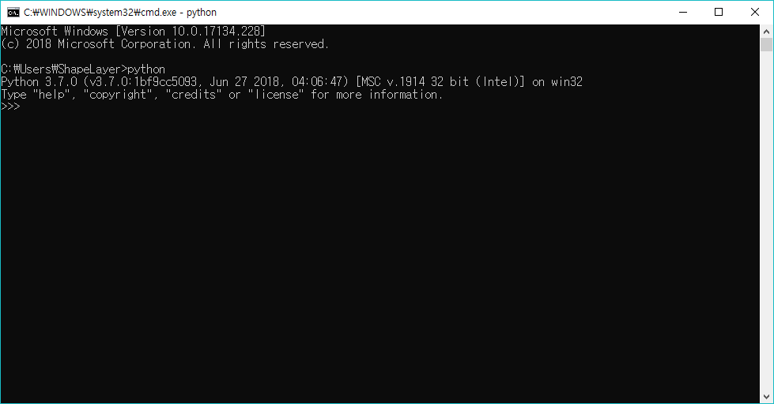
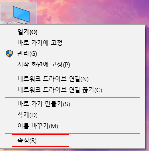
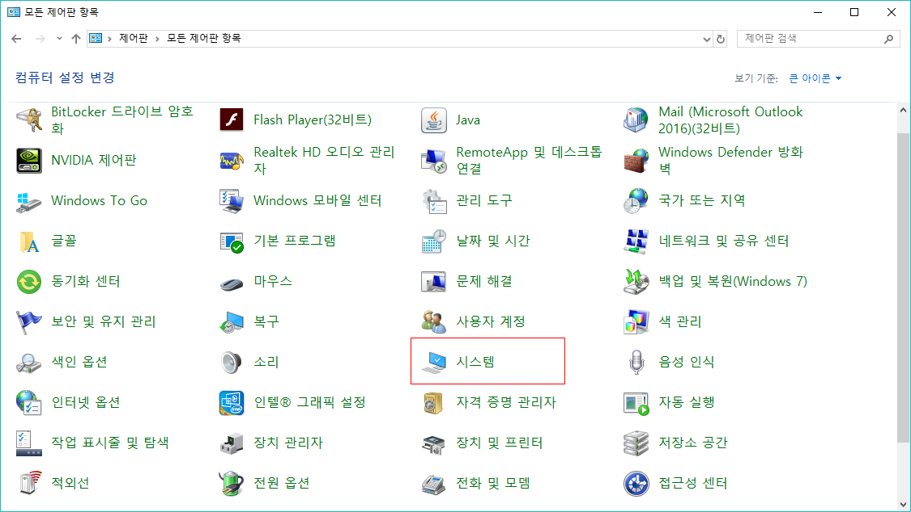
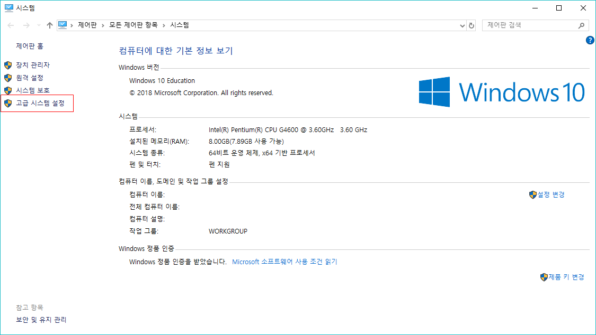
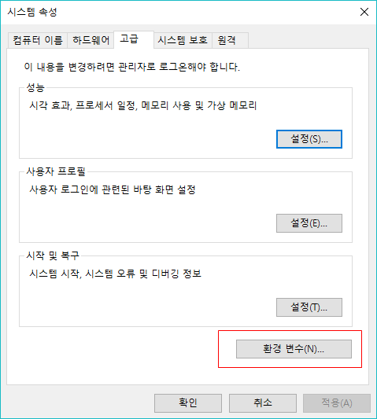
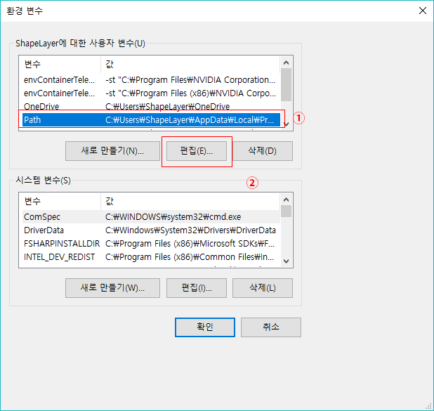
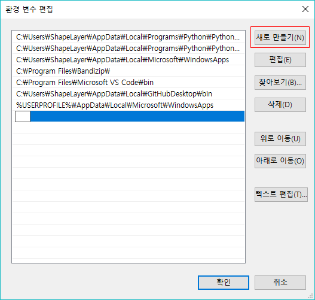
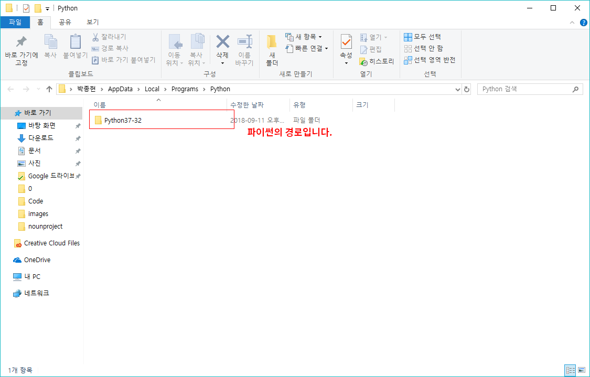

0장 준비하기
====

# I. 파이썬 설치
파이썬을 시작하려면 기기에 파이썬 개발환경이 설치되어 있어야 합니다. 파이썬 개발환경을 설치해 봅시다.

## Windows/Mac 환경
  

[파이썬 공식 홈페이지](https://python.org)에서 파이썬을 다운로드받습니다.

  

```Add Python 3.7 to PATH```에 체크하고 Install Now를 눌러 파이썬을 설치합니다. ```Add Python 3.7 to PATH```를 체크하지 않고 파이썬을 설치했다면 [여기](#앗-add-python-37-to-path에-체크하지-않고-설치를-눌러버렸어요)를 참고하세요.  

 * ```Add Python 3.7 to PATH```에 체크해야하는 이유:  
앞으로 파이썬은 _명령 프롬프트_ 라는 프로그램을 통해 실행할 예정입니다. 그러나 명령 프롬프트에서 파이썬을 손쉽게 사용하려면 몇가지 복잡한 설정이 필요하고, 그 설정을 프로그램이 쉽게 해주는 것이 이 메뉴입니다.  
  
만약 이 설정이 제대로 이루어지지 않았다면 이후에 파이썬을 실행하면 이런 문구가 나타날 것입니다.

 * **알**아두면 **쓸**모있는 **신**뢰와 안정의 **잡**다한 지식  
파이썬은 나날이 발전하는 언어입니다. 이 강의의 작성일 기준 최신 버전은 3.7이지만 이후엔 3.7.4, 3.8 등의 버전이 나올지도 모르는 법이죠.

  

파이썬 설치가 완료되었습니다. 명령 프롬포트나 터미널을 열어서 파이썬을 실행할 차례입니다.  

  

Windows 환경에서  + R 을 눌러 실행창을 엽니다.  

  

실행창에 ```cmd```를 입력하여 명령 프롬프트를 실행합니다.  

  

명령 프롬프트에서 ```python```을 입력하여 파이썬을 실행합니다.  

  

```
Python 3.7.0 (v3.7.0:1bf9cc5093, Jun 27 2018, 04:06:47) [MSC v.1914 32 bit (Intel)] on win32
Type "help", "copyright", "credits" or "license" for more information.
>>>
```
이런 식으로 뜨면 성공입니다.

 * **알**아두면 **쓸**모있는 **신**뢰와 안정의 **잡**다한 지식  
   * 기본적으로 이 검은창에 무언가를 입력해서 작업해야 한다면, 모두 입력한 뒤 Enter키를 눌러야 컴퓨터는 명령받은 작업을 실행합니다.  
   * 앞으로 파이썬을 실행한다고 하면 cmd를 통해 파이썬을 실행하는것을 의미합니다.  

## 앗 Add Python 3.7 to PATH에 체크하지 않고 설치를 눌러버렸어요.

  

컴퓨터를 우클릭하여 속성을 엽니다.

  

또는 제어판의 시스템을 통해서도 열 수 있습니다.

  

좌측 탭의 ```고급 시스템 설정```을 클릭하여 엽니다.



이어서 열리는 ```시스템 속성```에서 ```환경 변수```를 클릭하여 엽니다.

  

```환경 변수``` 에서 ```Path``` 값을 수정합니다. ```Path```를 선택하고 편집을 누릅니다.

  

새로 만들기를 눌러 아래 두 줄을 각각 추가하고 저장합니다.
```
%userprofile%\AppData\Local\Programs\Python\Python37-32
%userprofile%\AppData\Local\Programs\Python\Python37-32\Scripts
```

  

_Python37-32_ 는 파이썬 버전에 따라 경로가 달라질 수 있습니다.  + R 을 눌러 실행창을 열고 _%userprofile%\AppData\Local\Programs\Python_ 을 입력하면 _Python37-32_ 대신 어떤 폴더가 있는지 확인할 수 있습니다.

마지막으로, 컴퓨터를 재부팅합니다.

## Linux(Debian 계열) 환경
다음 명령어를 차례로 입력합니다.
```
sudo apt-get update
sudo apt-get upgrade  # 이 작업은 오래 걸릴 수도 있습니다.
sudo apt-get install python3 python3-pip python3-setuptools
```

  

 * **알**아두면 **쓸**모있는 **신**뢰와 안정의 **잡**다한 지식  
리눅스는 윈도우 환경에서와는 달리 파이선 2와 3을 엄격하게 구분해두고 있습니다. 윈도우와 달리 리눅스에서 파이썬은 ```python3```를 통해 실행할 수 있습니다.  

```
Python 3.5.2 (default, Nov 23 2017, 16:37:01)
[GCC 5.4.0 20160609] on linux
Type "help", "copyright", "credits" or "license" for more information.
>>>
```

이런 식으로 뜨면 성공입니다.

# II. 안녕, 세상아!

파이썬을 비롯해 프로그래밍 언어를 새로 시작할때, 사람들은 컴퓨터와 인사하는 관습이 있습니다. 이것은 새로운 프로그래밍 언어를 배우기 시작했다는 상징적이고 기념비적인 행위입니다. 파이썬이 제대로 작동하는지 확인해볼겸 우리도 한번 입력해보도록 하겠습니다.

파이썬을 실행합니다.

```
>>> print('Hello, World!')
```
를 입력합니다.

```
Hello, World!
```

이런 식으로 뜨면 성공입니다. 자세한 의미는 다음강에서 다루겠습니다.

 * **알**아두면 **쓸**모있는 **신**뢰와 안정의 **잡**다한 지식  
```print('Hello, World!')``` 앞의 ```>>> ```은 입력할 필요가 없습니다. 나중에 **파일로 파이썬을 실행할때** 다시 다뤄질 수 있는 부분입니다만, 명령 프롬프트나 터미널에서 ```python```만을 입력했을때 나타나는 문자가 ```>>> ```입니다. 이것을 **인터랙티브 모드**라고 합니다. 이 모드의 명칭을 외울 필요는 없습니다. 단지 ```>>> ```는 입력하지 않아도 되는 것이고, 미리 작성된 파일 없이 파이썬만을 실행하면 이와 같은 상태가 됨을 이해하고 있기만 하면 됩니다.

## 근데 왜 인터랙티브 모드라는걸 사용하나요?

인터랙티브 모드는 차례대로 파이썬 코드를 입력함으로써 바로 그 코드에 문제가 있는지 확인할 수 있다는 장점을 가지고 있습니다. 코드를 짜는 입장 역시 사람이기 때문에 언제든 사람의 실수가 발생할 수 있고, 그 이전에 아예 처음 다뤄보는 코드같은 경우에는 몇가지 예제 코드 작성을 필요로 하기도 합니다. 그렇기 때문에 인터랙티브 모드라는걸 사용하는 것입니다.

_아직은 시작단계라 무슨 의미인지 이해하기 힘들 수도 있습니다. 괜찮습니다. 인터랙티브 모드라는 개념은 어려운 개념입니다. 이후 몇강을 좀더 보고 다시 돌아와 인터랙티브 모드를 이해해도 됩니다._