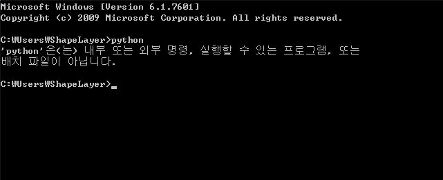
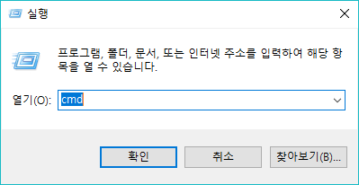
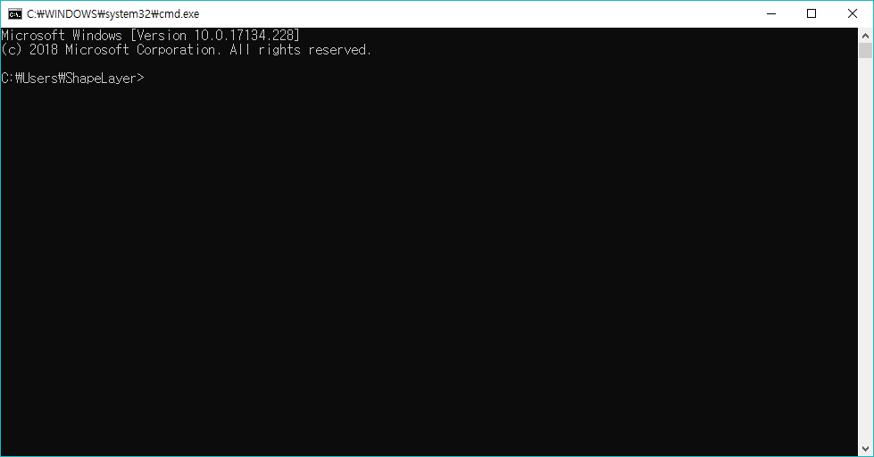
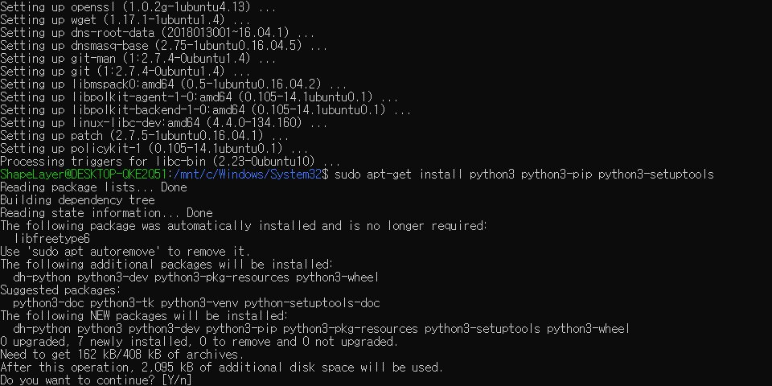

0장 준비하기
====

# 파이썬 설치
파이썬을 시작하려면 기기에 파이썬 개발환경이 설치되어 있어야 합니다. 파이썬 개발환경을 설치해 봅시다.

## Windows/Mac 환경
  

[파이썬 공식 홈페이지](https://python.org)에서 파이썬을 다운로드받습니다.

  

```Add Python 3.7 to PATH```에 체크하고 Install Now를 눌러 파이썬을 설치합니다. ```Add Python 3.7 to PATH```를 체크하지 않고 파이썬을 설치했다면 [여기](#)를 참고하세요.  

 * ```Add Python 3.7 to PATH```에 체크해야하는 이유:
앞으로 파이썬은 _명령 프롬프트_ 라는 프로그램을 통해 실행할 예정입니다. 그러나 명령 프롬프트에서 파이썬을 손쉽게 사용하려면 몇가지 복잡한 설정이 필요하고, 그 설정을 프로그램이 쉽게 해주는 것이 이 메뉴입니다.  
  
만약 이 설정이 제대로 이루어지지 않았다면 이후에 파이썬을 실행하면 이런 문구가 나타날 것입니다.

  

파이썬 설치가 완료되었습니다. 명령 프롬포트나 터미널을 열어서 파이썬을 실행할 차례입니다.  

  

Windows 환경에서  + R 을 눌러 실행창을 엽니다.  

  

실행창에 ```cmd```를 입력하여 명령 프롬프트를 실행합니다.  

  

명령 프롬프트에서 ```python```을 입력하여 파이썬을 실행합니다.  

 * **알**아두면 **쓸**모있는 **신**뢰와 안정의 **잡**다한 지식  
  * 기본적으로 이 검은창에 무언가를 입력해서 작업해야 한다면, 모두 입력한 뒤 Enter키를 눌러야 컴퓨터는 명령받은 작업을 실행합니다.  
  * 앞으로 파이썬을 실행한다고 하면 cmd를 통해 파이썬을 실행하는것을 의미합니다.  

## Linux(Debian 계열) 환경
다음 명령어를 차례로 입력합니다.
```
sudo apt-get update
sudo apt-get upgrade  # 이 작업은 오래 걸릴 수도 있습니다.
sudo apt-get install python3 python3-pip python3-setuptools
```

  

 * **알**아두면 **쓸**모있는 **신**뢰와 안정의 **잡**다한 지식  
  * 리눅스는 윈도우 환경에서와는 달리 파이선 2와 3을 엄격하게 구분해두고 있습니다. 윈도우와 달리 리눅스에서 파이썬은 ```python3```를 통해 실행할 수 있습니다.  

