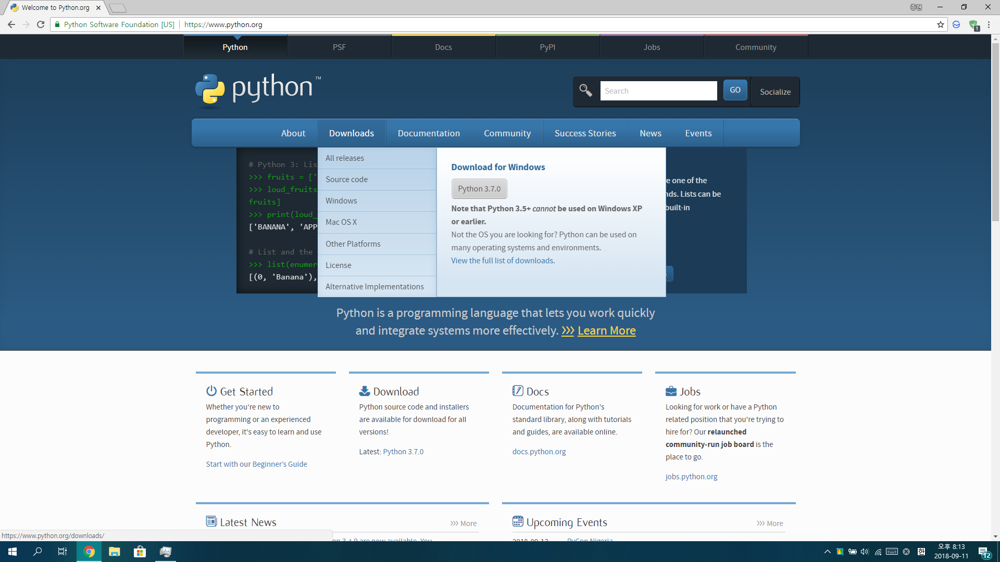
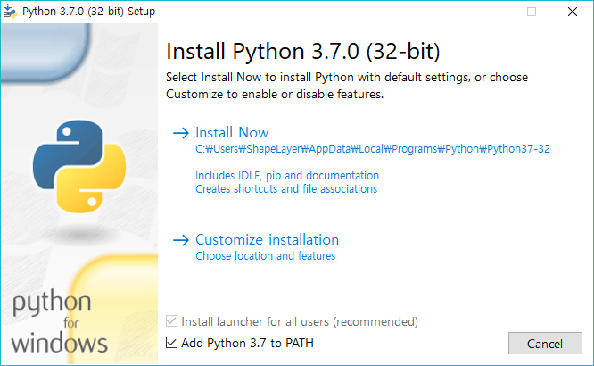
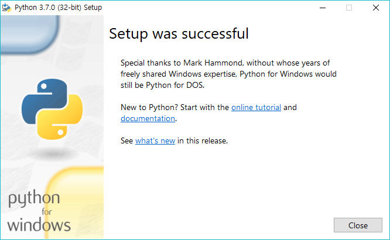

0장 준비하기
====

# 파이썬 설치
파이썬을 시작하려면 기기에 파이썬 개발환경이 설치되어 있어야 합니다. 파이썬 개발환경을 설치해 봅시다.

## Windows/Mac 환경
  
[파이썬 공식 홈페이지](https://python.org)에서 파이썬을 다운로드받습니다.

  
```Add Python 3.7 to PATH```에 체크하고 Install Now를 눌러 파이썬을 설치합니다. ```Add Python 3.7 to PATH```를 체크하지 않고 파이썬을 설치했다면 [여기](#)를 참고하세요.

  
파이썬 설치가 완료되었습니다.

명령 프롬포트나 터미널을 열어서 파이썬을 실행할 차례입니다.  
![Image: 0-4]
Windows 환경에서  + R 을 눌러 실행창을 엽니다.
![Image: 0-5]
실행창에 ```cmd```를 입력하여 명령 프롬프트를 실행합니다.
![Image: 0-6]
명령 프롬프트에서 ```python```을 입력하여 파이썬을 실행합니다.